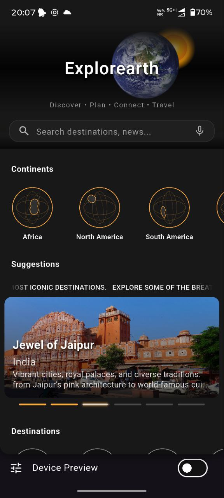

# ExploEarth 🌍

ExploEarth is a Flutter-based UI-focused travel exploration app that allows users to discover continents, destinations, travel news, and trending content through a modern, immersive interface.

## ✨ Features
- 🌎 Explore all **7 continents** with dedicated detail screens
- ⭐ **Top destinations** and animated suggestion stories
- 🧭 Destination categories with **tab-based navigation**
- 📰 Integrated **travel news sources**
- 🎥 Trending travel videos section
- 🌙 Clean, dark-themed and responsive UI
- 🎞 Smooth animations and auto-scrolling content

## 🎥 App Demo

### UI Preview (Vimeo)
![ExploEarth UI Demo]


## 📸 Screenshots / Videos

| Section | Preview |
|-------|--------|
| Home Screen | [](https://vimeo.com/1146969963) |
| Continent Section | [](https://vimeo.com/1146970088) |
| Destinations | [](https://vimeo.com/1146970220) |
| News WebViews | [](https://vimeo.com/1146970172) |


> 📌 Screenshots are for UI demonstration purposes.

## 🛠 Tech Stack
- **Flutter** (Material UI)
- **Dart**
- PageView, TabBar, WebView, Animations
- Modular & reusable widget architecture

## 🧩 App Structure
- Home Screen (Continents, Suggestions, Destinations, News, Trending)
- Continent Detail Pages
- Destination Categories with Tabs (Places, News, Groups)
- Media-rich UI sections with smooth transitions

## 🎯 Project Purpose
This project is built as a Flutter UI/UX skills showcase, focusing on modern layout design, Live API Integration with real data, animations, navigation flow, and scalable application structure.

## 🚀 Getting Started
```bash
git clone https://github.com/your-username/ExploEarth.git
cd ExploEarth
flutter pub get
flutter run
